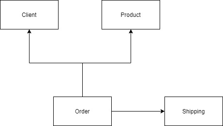

# TSC Store Challenge

This is a simple application to manage the order of products in a store. To achieve this we have the entities' **client**,  **product** and **order**.

The application should provide the following operations for each entity:

- Client:
    - CRUD operations
- Product:
    - CRUD operations
- Order:
    - Create an order passing the client that is making the order, a list with the products and the amount of each.
    - Retrieve the information of an existing order.
    - Generate the receipt of an order with information about the client, the products ordered and shipping details.

## Technologies used

- Java 11
- Maven
- Spring boot
- Spring Data JPA
- H2 database
- Junit 5
- Mockito
- Spring boot starter test

## Architectural Design

The project was developed focusing on breaking the problem on separate applications following the main concepts of a [Clean Architecture](https://blog.cleancoder.com/uncle-bob/2012/08/13/the-clean-architecture.html). 
The separation of the components and interaction between one another can be seen on the image below.

<p align="center">    
     </p>  

This application could've been developed to be used in a micro-service architecture, but it was preferred as a 
monolithic application due to the simplicity of the problem.

It was architecture to be easily broken down on different independent services that can communicate through an IO 
interface. To achieve this, the client, product and order applications can be separated and used along with any HTTP server framework or persistence tool.

## Folde structure

- **client**: this project contains the domain and use cases used on the operations of the client;
- **product**: this project contains the domain and use cases used on the operations of the product;
- **order**: this project contains the domain and use cases used on the operations of the order;
- **persistence**: this project contains the implementation of the output ports, in this case, the persistence of the entities, for example, the client, product, etc.
- **app**: this project implements the REST interface of the project that will get the inputs through the HTTP
  protocol and call the proper resources with the parameters provided on the communication.

## Unit tests

Unit tests were implemented to code most important for the application, which was the operations made on the domain of the applications, and the controllers of the REST interface.

Tests were not written for the persistence application because there's not much business rules there to be tested.

## Running the project

### Docker

```  
docker build --tag tscstore-wallyson .  
docker run --name desafio-wallyson -p 8090:8090 -p 8091:8091 tscstore-wallyson  
```  

### Maven

```  
mvn -pl spring-boot:run  
```  

Running this application with one of the mentioned ways should serve the application on `http://localhost:8090/`, and
the H2 Database console on `http://localhost:8091/`.

The database console can be accessed with the values below:

```
JDBC URL: jdbc:h2:mem:tcs-store
Password: password
```

## Running the tests

### Maven

```  
mvn test  
```  

A pipeline was configured on GitLab to **build the application** (so we make sure that the application is building properly) 
and to **run all the tests**. It can be accessed through [THIS LINK](https://gitlab.com/wallysoncarvalho/tcs-store/-/pipelines).

## REST interface

For a description of the API, a swagger specification was created at the root of the project
named `swagger-specs.yaml` and it can be imported in the [online swagger editor](https://editor.swagger.io/) for a 
detailed description of the application REST interface.

After the application is up and running, one can also import the [Postman](https://www.postman.com/) collection
provided on the file `postman_collection.json` to easily call the API resources.

## Final notes about the current implementation

There are some improvements that can be done on the project, and some things that were left pending:

- Change the creation of an order to also store the time;
- Group repetitions of products on the order creation;
- Validate the fields of the inputs, like name size, CEP format, phone, among others;
- Postman tests;
- Proper calculation of the shipping tax according to the table provided;